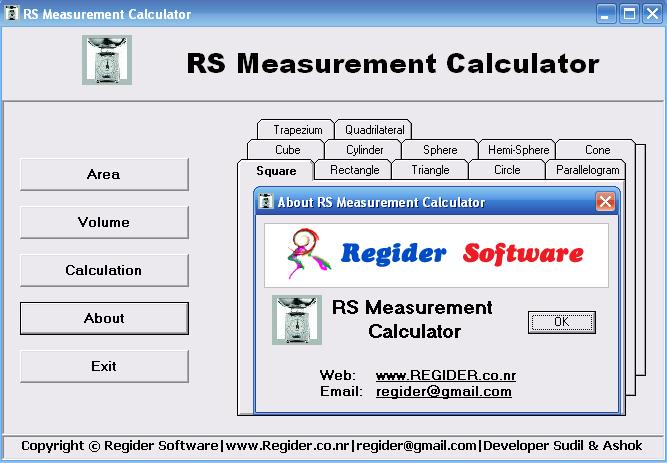



## Measurement Calculator v1\.0

### Description

This code will calculate area and volume of different geometrical shape and rigid body.
 
### More Info
 

             |
---                |---
**Submitted On**   |2006-05-29 03:00:24
**By**             |[Sudil & Ashok](https://github.com/Planet-Source-Code/PSCIndex/blob/master/ByAuthor/sudil-ashok.md)
**Level**          |Advanced
**User Rating**    |5.0 (15 globes from 3 users)
**Compatibility**  |VB 6\.0
**Category**       |[Math/ Dates](https://github.com/Planet-Source-Code/PSCIndex/blob/master/ByCategory/math-dates__1-37.md)
**World**          |[Visual Basic](https://github.com/Planet-Source-Code/PSCIndex/blob/master/ByWorld/visual-basic.md)
**Archive File**   |[Measuremen20245910122006\.zip](https://github.com/Planet-Source-Code/sudil-ashok-measurement-calculator-v1-0__1-66762/archive/master.zip)

